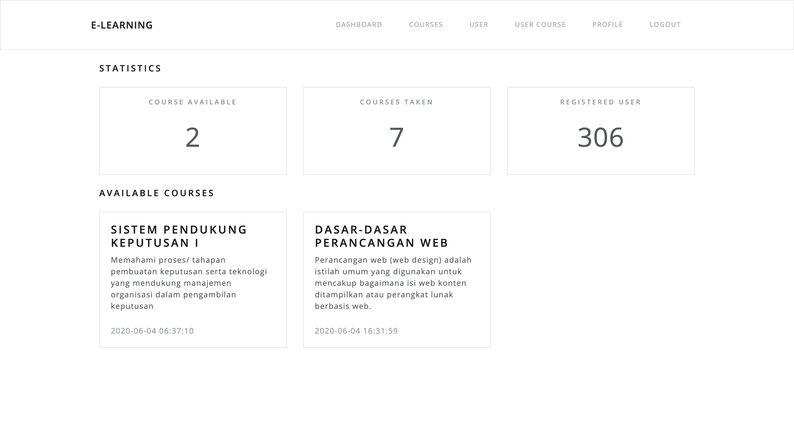
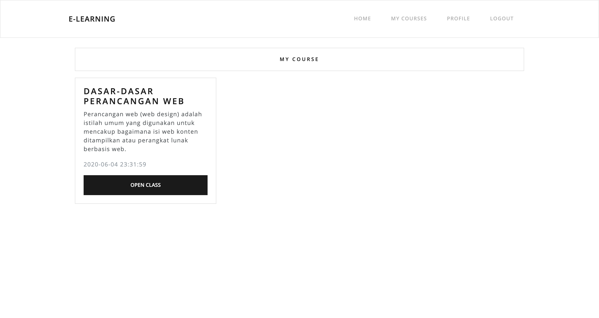
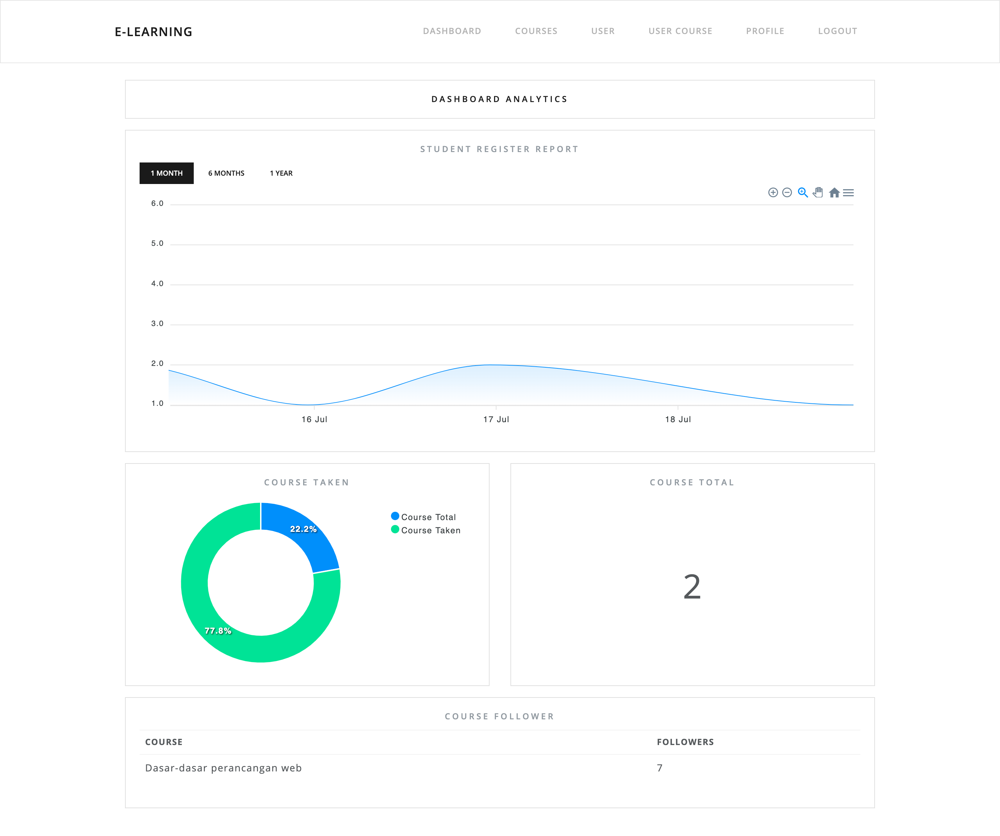
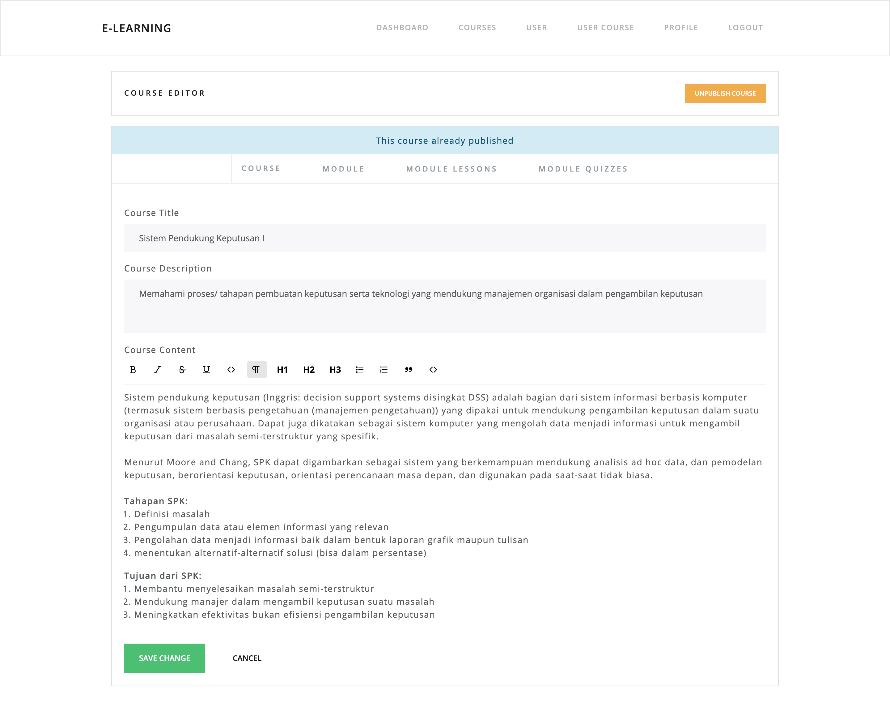
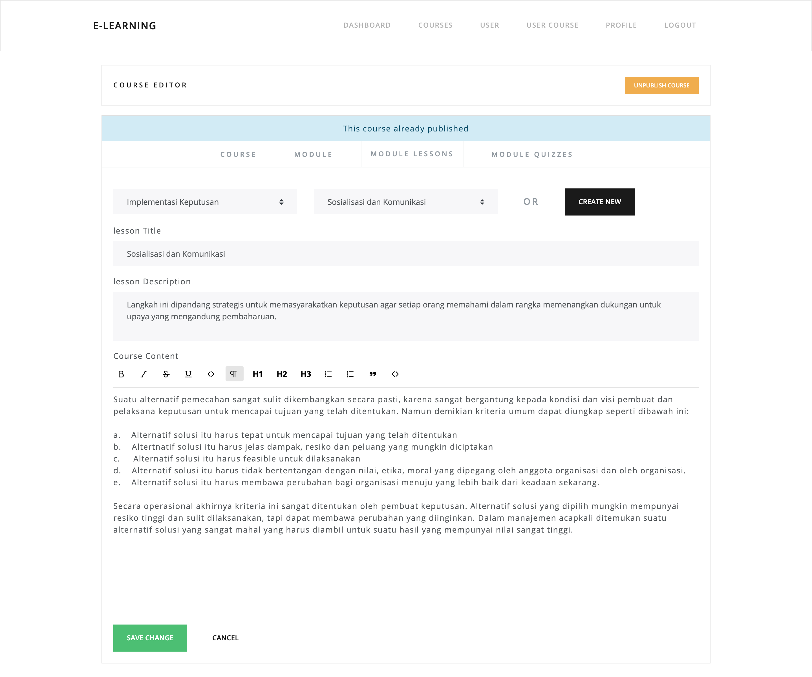
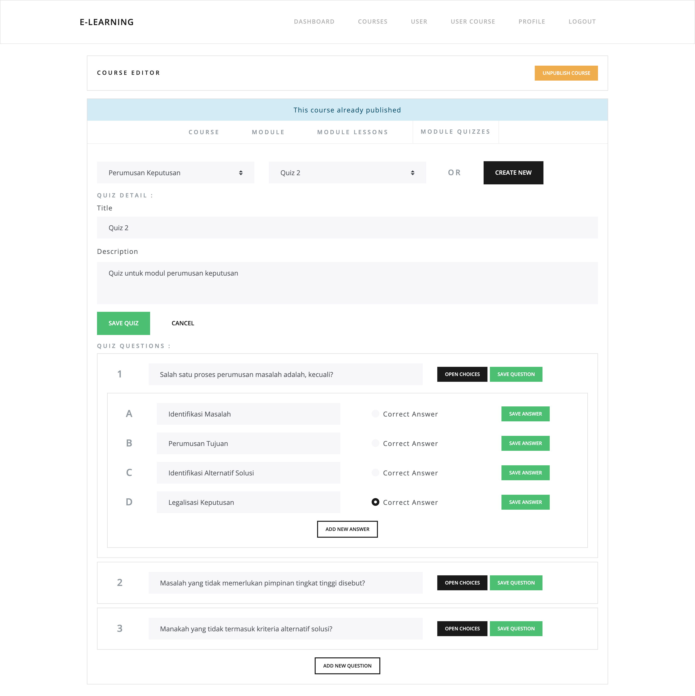
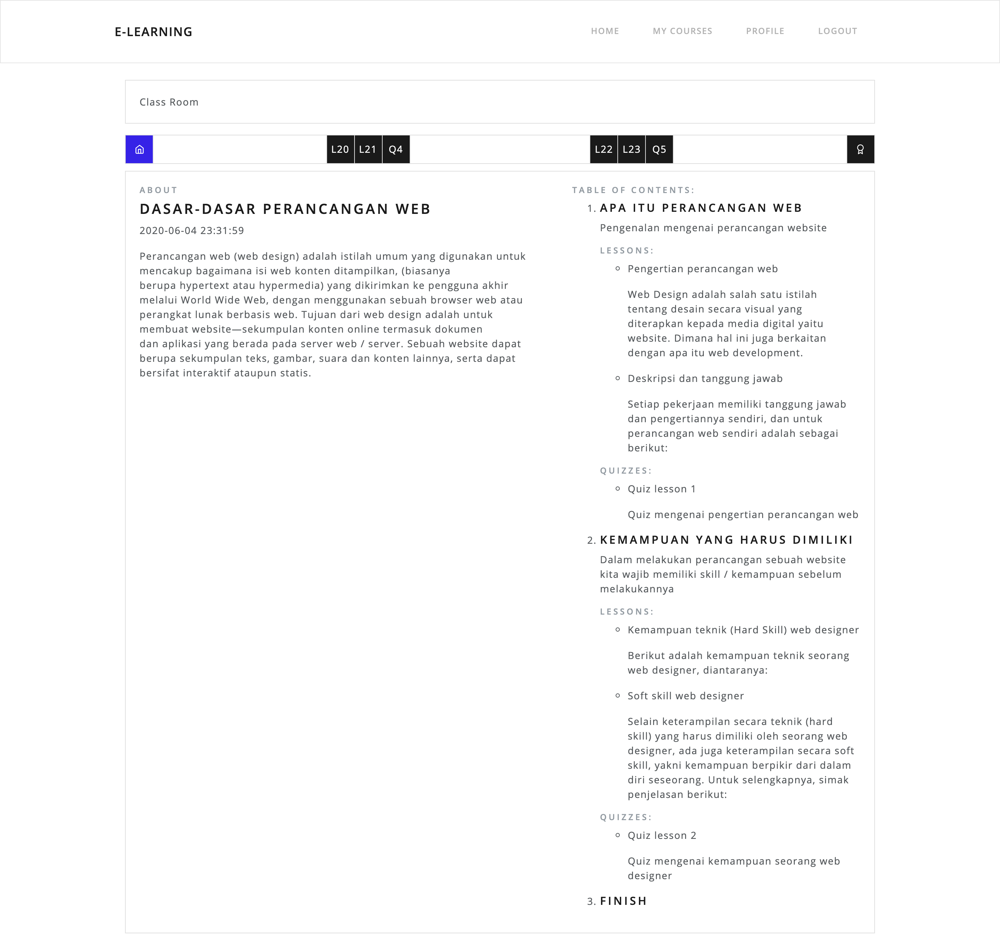
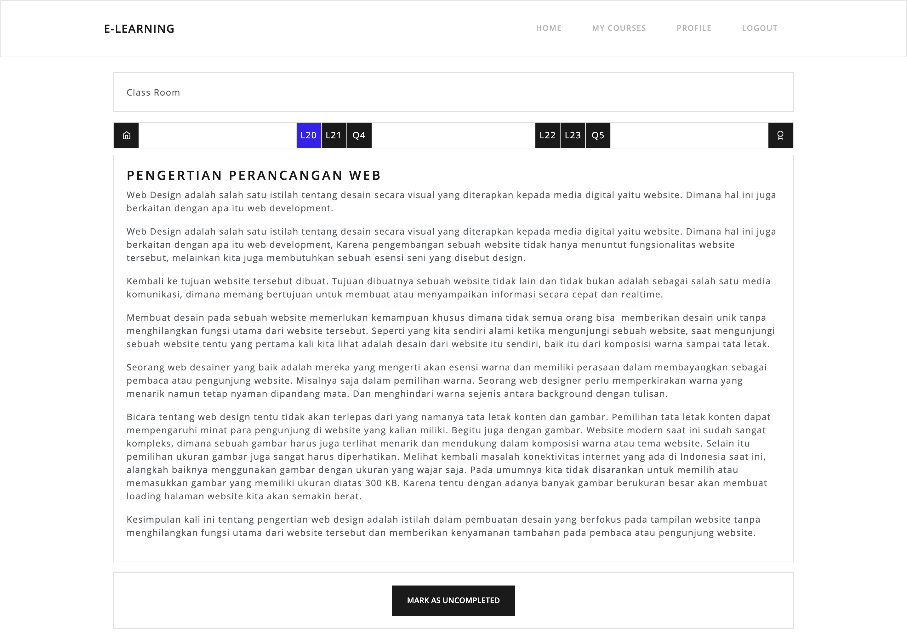
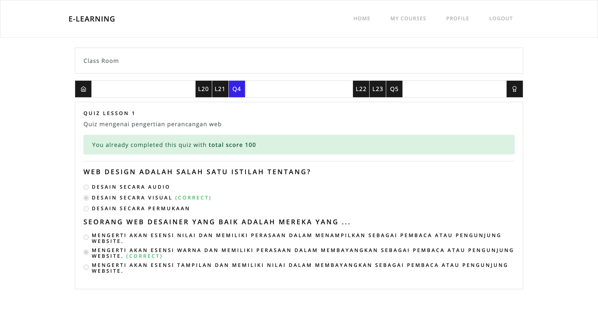

# E-Learning

Initially this project was made only for the purpose of college examinations and was developed to a later stage and made it a product. But we can't commit to it yet as we have other tasks we need to focus on, so we open this project to the public with all the requirement, source database, ER diagrams and also postman documentation.

Thank you very much for seeing this project, we hope this project can help you or you can use it as an experimental project for learning.

> You can view the live version of this project at [this url](https://learn.nakama.design/).

## What's in it?

- Laravel 7.x
- Vue 2.x
- Bootstrap 4
- Vue Auth
- ApexChart
- TipTap WYSIWYG
- Feather icon

## About Laravel

Laravel is a web application framework with expressive, elegant syntax. We believe development must be an enjoyable and creative experience to be truly fulfilling. Laravel takes the pain out of development by easing common tasks used in many web projects, such as:

- [Simple, fast routing engine](https://laravel.com/docs/routing).
- [Powerful dependency injection container](https://laravel.com/docs/container).
- Multiple back-ends for [session](https://laravel.com/docs/session) and [cache](https://laravel.com/docs/cache) storage.
- Expressive, intuitive [database ORM](https://laravel.com/docs/eloquent).
- Database agnostic [schema migrations](https://laravel.com/docs/migrations).
- [Robust background job processing](https://laravel.com/docs/queues).
- [Real-time event broadcasting](https://laravel.com/docs/broadcasting).

Laravel is accessible, powerful, and provides tools required for large, robust applications.

## Learning a Laravel

Laravel has the most extensive and thorough [documentation](https://laravel.com/docs) and video tutorial library of all modern web application frameworks, making it a breeze to get started with the framework.

If you don't feel like reading, [Laracasts](https://laracasts.com) can help. Laracasts contains over 1500 video tutorials on a range of topics including Laravel, modern PHP, unit testing, and JavaScript. Boost your skills by digging into our comprehensive video library.

## Screenshots

|General Home|General User|Admin Dashboard|
|---|---|---|
||||

|Admin Editor Course|Admin Editor Lesson|Admin Editor Quiz|
|---|---|---|
||||

|Class Home|Class Module|Class Quiz|
|---|---|---|
||||

## Default Credential

#### Administrator

- Username : admin@e-learning.com
- Password : admin

#### Student

- Username : student@e-learning.com
- Password : student

## Deployment to a Server

### Requirements

- Nginx or Apache Web Server (we use nginx/1.18.0)
- MySQL or MariaDB SQL Database (we use 8.0.21-0ubuntu0.20.04.4 for Linux on x86_64)
- PHP FPM (we use PHP 7.2.33-1+ubuntu20.04.1+deb.sury.org+1)
- PHP Composer (we use version 1.10.10)
- NodeJS & NPM (we use Node v10.13.0 & NPM 6.14.7)
- PHP Modules that required on [this page](https://laravel.com/docs/7.x/installation)

### Step by step Deployment

1. Make sure your machine are already have a Nginx/Apache, MySQL, PHP or you can follow [this post](https://www.digitalocean.com/community/tutorials/how-to-install-linux-nginx-mysql-php-lemp-stack-on-ubuntu-20-04) to setup your machine.

2. Make sure you already learn a Laravel and know how to install & configure it on Unix stack, or you can follow [this post](https://www.digitalocean.com/community/tutorials/how-to-install-and-configure-laravel-with-lemp-on-ubuntu-18-04) to install & configure laravel on Ubuntu.

3. Open a MySQL database and create new database called **e_learning**.

```bash
$ mysql -u root -p
> create database e_learning;
```

4. Import a source database from file E-Learning Database into your database.

```bash
$ mysql -u root -p e_learning < E-Learning\ Database.sql
```

5. Create ENV file with content like file **.env.example** and configure your Database & App configuration on that file.

6. Create a Virtual Domain on Nginx by creating a file on **sites-enabled** like this

```bash
$ vi /etc/nginx/sites-enabled/domain
```

And fill that file with content like example below.

```bash
server {
    server_name domain;
    root /home/domain/learn/public;

    add_header X-Frame-Options "SAMEORIGIN";
    add_header X-XSS-Protection "1; mode=block";
    add_header X-Content-Type-Options "nosniff";

    index index.php;

    charset utf-8;

    location / {
        try_files $uri $uri/ /index.php?$query_string;
    }

    location = /favicon.ico { access_log off; log_not_found off; }
    location = /robots.txt  { access_log off; log_not_found off; }

    error_page 404 /index.php;

    location ~ \.php$ {
        fastcgi_pass unix:/var/run/php/php7.2-fpm.sock;
        fastcgi_param SCRIPT_FILENAME $realpath_root$fastcgi_script_name;
        include fastcgi_params;
    }

    location ~ /\.(?!well-known).* {
        deny all;
    }
}
```

7. Last build a styles and Vue component with this NPM command below.

```bash
$ npm install
$ npm run prod
```

8. This project will work on a domain that you have configured.

## License

The Laravel framework is open-source software licensed under the [MIT license](LICENSE.md).